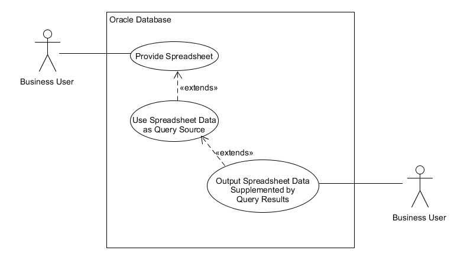

# app_read_xlsx - An Oracle Object Type and Package for reading an XLSX worksheet

Anton Scheffer's *as_read_xlsx* is the go-to tool for reading an Excel spreadsheet in PL/SQL.
*app_read_xlsx* extends *as_read_xlsx* providing a SQL
statement that presents the spreadsheet data as **ANYDATA** values with SQL column names
matching the column headers from the first row.

*as_read_xsx* is included in the distribution, but you can find the original source in 
a link named "here" from [this page](https://technology.amis.nl/languages/oracle-plsql/read-a-excel-xlsx-with-plsql/)
if you want to verify. The only change I made was to set invoker rights via an *AUTHID CURRENT_USER* package attribute.

A slight tweak to Marc Bleron's [ExcelGen](https://github.com/mbleron/ExcelGen) supports **ANYDATA** type columns
in the input cursor such that you can copy data, even messy data with varying data types within columns, from one spreadsheet
to another. That tweak lives in [a fork of ExcelGen](https://github.com/lee-lindley/ExcelGen/tree/anydata) at the moment.
Marc is refactoring *ExcelGen* so the pull request will not be accepted; however, we have a soft commitment to consider support 
of **ANYDATA** columns in the future.

# Content

- [Installation](#installation)
- [Use Case](#use-case)
- [Examples](#examples)
- [How it Works](#how-it-works)
- [Manual Page](#manual-page)

# Installation

Clone this repository or download it as a [zip](https://github.com/lee-lindley/app_read_xlsx/archive/refs/heads/main.zip)
archive.

The file *install.sql* has a few define values you may what to change:

- *GRANT_LIST* - The required set of grants are provided to schemas in this string. It can be multiple schemas comma separated. The default is **PUBLIC**.
- *d_arr_varchar2_udt* - The name to use for a User Defined Type defined as a TABLE OF VARCHAR2(4000). You may already have one. The default name is *arr_varchar2_udt*.
- *compile_arr_varchar2_udt* - The default of **TRUE** means we will create the type named by *d_arr_varcahr2_udt*. **FALSE** indicates you already have one and do not want to create or replace it.

Once you complete any changes to *install.sql*, run it with sqlplus:

`sqlplus YourLoginConnectionString @install.sql`

The script runners in Toad or SqlDeveloper should also work just fine, but I did not test them.

# Use Case

|  |
|:--:|
| app_read_xlsx_udt Use Case Diagram |

Premise: Spreadsheet users do naughty things like put strings in the middle of date columns. A string like 'N/A' will invalidate
an assumption that the column contains either a valid date or NULL in all rows. You can convert everything to strings,
but when you load back into another spreadsheet, that is less than desirable.

The primary use case for this tool is to ingest messy spreadsheet data, use the less messy parts
to join to other database tables to gather additional information, then faithfully reproduce the original
spreadsheet data in an output spreadsheet while adding one or more columns of supplemental data.

*app_read_xlsx* provides for ingesting the data. Outputting a new spreadsheet requires an XLSX generator
such as [ExcelGen](https://github.com/mbleron/ExcelGen)
(or temporarily while ExcelGen is being refactored, [ExcelGen Fork](https://github.com/lee-lindley/ExcelGen/tree/anydata)).

# Examples

The first example reads the spreadsheet data into a global temporary table, then prints out a SQL
statement that you can use during that session. In practice one would build a dynamic SQL statement
in a program using that string.

```sql
DECLARE
    v_o app_read_xlsx_udt;
BEGIN
    -- read sheet 1 of the spreadsheet found on the database server in a directory mapped to TMP_DIR
    v_o := app_read_xlsx_udt(TO_BLOB(BFILENAME('TMP_DIR', 'Book1.xlsx')), '1');
    DBMS_OUTPUT.put_line(v_o.get_sql);
END;
/
-- resulting output:
SELECT X.R.data_row_nr AS data_row_nr,
   X.R.get(1) AS "id"
    ,X.R.get(2) AS "data"
    ,X.R.get(3) AS "ddata"
  FROM (
    SELECT VALUE(t) AS R -- full object, not the object members * would provide
    FROM TABLE(LEE.app_read_xlsx_udt.get_data_rows(1,3)) t
  ) X
```

The second example will input a spreadsheet as pictured here. You can find the xlsx input and output files
in the test directory.

|  |
|:--:|
| test_salaries spreadsheet|

Notice the "Decision Date" column contains cells that are not dates. We read this data, treat the "Emp #" column
as a number (handle exceptions as you see fit) and join to **hr.employees** to retrieve the name and current salary.
We then output a new spreadsheet with the joined data elements together with the original spreadsheet content.


```sql
DECLARE
    v_o             app_read_xlsx_udt;
    v_sql           VARCHAR2(32767);
    v_ctxId         ExcelGen.ctxHandle;
    v_sheetHandle   BINARY_INTEGER;
BEGIN
    v_o := app_read_xlsx_udt(to_blob(bfilename('TMP_DIR' ,'test_salaries.xlsx')), '1');
    v_sql := 'WITH a AS (
'||v_o.get_sql||q'{
)
, b AS (
    SELECT a.data_row_nr
        ,CASE SYS.ANYDATA.getTypeName("Emp #")
            WHEN 'SYS.NUMBER' THEN SYS.ANYDATA.accessNumber("Emp #")
        END AS employee_id
    FROM a
)
, c AS (
    SELECT b.data_row_nr
        ,e.salary AS "Old Salary"
        ,e.first_name||' '||e.last_name AS "Name"
    FROM b
    INNER JOIN hr.employees e
        ON e.employee_id = b.employee_id
    WHERE b.employee_id IS NOT NULL
)
SELECT a.*, c."Old Salary", c."Name"
FROM a
LEFT OUTER JOIN c
    ON c.data_row_nr = a.data_row_nr
}';

    DBMS_OUTPUT.put_line(v_sql);
    v_ctxId := ExcelGen.createContext();
    v_sheetHandle := ExcelGen.addSheetFromQuery(v_ctxId, v_o.get_sheet_name, v_sql, p_sheetIndex => 1);
    -- freeze the top row with the column headers
    ExcelGen.setHeader(v_ctxId, v_sheetHandle, p_frozen => TRUE);
    -- style with alternating colors on each row.
    ExcelGen.setTableFormat(v_ctxId, v_sheetHandle, 'TableStyleLight2');
    -- anydata type comes in as a number. Set format for this column to date. strings will be fine
    ExcelGen.setColumnFormat(v_ctxId, v_sheetHandle, 4, 'MM/DD/YYYY');
    ExcelGen.createFile(v_ctxId, 'TMP_DIR', 'test_salaries_output.xlsx');
    ExcelGen.closeContext(v_ctxId);
    --v_o.destructor;
END;
/
```

|  |
|:--:|
| test_salaries_output spreadsheet|

Of note is that we did not need to know very much about the input spreadsheet. We needed to know which
sheet (ordinal position) to read and the name of the column that contained the *employee number*. We did
not absolutely require knowledge of anything else in that spreadsheet and the users could change or
add columns without impacting this code.

The one exception is that we need to know which columns are primarily date columns. The reason is that Excel
treats dates and numbers the same. A date is just a number until formatting is applied. If we do not tell
Excel that a column is mostly date values, it will display a number in the date column. If we know which columns
are dates, we can tell *ExcelGen* to format the column as a date. Likewise if we know certain columns are primarily
numbers and should be formatted a certain way, we can use that knowledge of the input spreadsheet to make the
output look nicer, but none of that is required.

# How it Works

## Overview

- The input datastream from *as_read_xlsx* is a table of cell data. The ordinal row and column numbers of the spreadsheet are columns/attributes in this data stream. 
- Empty cells are not present in the data. 
- The concept of column headers and database identifiers for the columns is not present in this structure.
- Each cell is represented with a polymorphic structure containing a *cell_type* attribute and a value in one of the attributes *string_val*, *number_val*, *date_val*, *formula*. *formula* is out of scope for this implementation. Our design pattern converts this polymorphic structure into an Oracle **ANYDATA** object type.

Presenting the cell data in a two dimensional standard database pattern requires

- pivot spreadsheet columns into rows
- extract column identifiers and number of columns from the first row of the input data
- densify the missing/empty cells
- convert multi-attribute polymorphic cell representation into **ANYDATA** objects
- present the **ANYDATA** cell objects in standard database TABLE structure with rows and columns named from the spreadsheet column headers

Doing this requires a runtime determination of the resultset type. It is not difficult to do this for a PL/SQL cursor
as we can use a weakly typed SYS_REFCURSOR. It is much harder to present the results to the SQL engine in a way
that the resultset may be joined and extended.

## Considerations

When one hears the term **polymorphic resultset**, we instantly turn to the cool new Oracle toy (well, new as of Oracle 18c)
of **Polymorphic Table Functions**. Unfortunately, this design pattern only supports standard Oracle datatypes. Object
types such as **ANYDATA** are not supported, at least as of Oracle 19c.

Another method for achieving this is the **ANYDATASET** technique which is built with **ANYTYPE**. Building these requires
producing ODCI level code, whether in PL/SQL or another compiled language such as Java or C. Although this pattern
can be followed reasonably well at a cookbook level for standard data types with a moderate level of study, 
extending it to handle piece-wise construction of complex object types such as the **ANYDATA** objects is non-trivial.
(see *ExcelTable.getRows* in [ExcelTable](https://github.com/mbleron/ExcelTable) for an example of using **ANYDATA**
with standard datatypes.)
This is a level of complexity the author has seldom observed within most corporate IT departments. If there were
community support of this I would be willing, but for this project it exceeds the complexity level with which I'm comfortable
encumbering my current employer.

The level of complexity I settled on was using a compile time known object type representing a row,
and standard pipelined table function returning a collection of that row object type. This is a well known
and documented technique that should be in the wheelhouse of most journeyman level Oracle practitioners.
The only slightly tricky part I added was the use of a nested table collection inside this object
and an object method named **get** for extracting members of that nested table in a SQL statement.

## Technique

We start with a collection object type of **ANYDATA** objects.

```sql
CREATE OR REPLACE TYPE arr_anydata_udt FORCE AS TABLE OF sys.anydata;
/
```

Next we build an object type that can be piped from our table function:

```sql
CREATE OR REPLACE TYPE app_read_xlsx_row_udt FORCE AS OBJECT (
    data_row_nr NUMBER
    ,aa         arr_anydata_udt
    ,MEMBER FUNCTION get(p_i NUMBER) RETURN SYS.anydata
);
/
```
You can look at the type body at your leisure. The *get* method is necessary to access a member
of the nested table collection from within SQL (inside PL/SQL you could just use aa(i)).

Then to be able to define our pipelined table function we need a nested table type of these elements:

```sql
CREATE OR REPLACE TYPE arr_app_read_xlsx_row_udt FORCE AS TABLE OF app_read_xlsx_row_udt;
/
```

Our pipelined table function (which is a static member method of our main object type *app_read_xlsx_udt*) 
can then be declared as:

```sql
    STATIC FUNCTION get_data_rows(
         p_ctx      NUMBER
        ,p_col_cnt  NUMBER
    ) RETURN arr_app_read_xlsx_row_udt PIPELINED
```

This still leaves the task of generating a SQL select list that turns the collection elements *aa.get(i)*
into columns with an identifier based on the first row of the spreadsheet. That is done by calling the *get_sql*
method of *app_read_xlsx_udt*. It builds a dynamic SQL statement for you that you can then use as part
of a larger application level SQL statement as shown in the examples section and reproduced here.

```sql
SELECT X.R.data_row_nr AS data_row_nr,
   X.R.get(1) AS "id"
    ,X.R.get(2) AS "data"
    ,X.R.get(3) AS "ddata"
  FROM (
    SELECT VALUE(t) AS R -- full object, not the object members * would provide
    FROM TABLE(LEE.app_read_xlsx_udt.get_data_rows(1,3)) t
  ) X
```


# Manual Page

## app_read_xlsx_udt constructor

Creates the object from the provided spreadsheet as a BLOB. The other two arguments are for *as_read_xlsx*. You will
generally provide the ordinal number for a sheet you want to read as a string. Although *as_read_xlsx* supports reading
more than one sheet, *app_read_xlsx_udt* does not.

Data from the spreadsheet is stored in a global temporary table named *as_read_xlsx_gtt* for the life of the session
(unless *destructor* method is called).

```sql
    CONSTRUCTOR FUNCTION app_read_xlsx_udt(
        p_xlsx      BLOB
        ,p_sheets   VARCHAR2 := NULL
        ,p_cell     VARCHAR2 := NULL
    ) RETURN SELF AS RESULT
```

## get_sql

Returns a string containing a SQL SELECT statement the columns of which have the names of the column headers in
the first row of the input spreadsheet. The column values are type **ANYDATA**. 

```sql
    MEMBER FUNCTION get_sql RETURN CLOB
```

## get_col_names

Returns a collection of type **arr_varchar2_udt** (unless you configured a different type name in the install.sql script)
consisting of the input spreadsheet column header values. Case is preserved. Beware that if you use these strings
to construct dynamic sql, you should protect them with double quotes. This list does not include the special column
*data_row_nr* that is added to the resultset provided by *get_sql*.

```sql
    MEMBER FUNCTION get_col_names RETURN arr_varchar2_udt
```

## get_col_count

Returns the number of columns from the input spreadsheet that have headers. Same as number of elements in the collection
returned by *get_col_names*.

```sql
    MEMBER FUNCTION get_col_count RETURN NUMBER
```

## get_ctx

Returns the context number that is a key value for selecting from the *as_read_xlsx_gtt* global temporary table. The
context number allows having multiple input spreadsheets in the same session.

```sql
    MEMBER FUNCTION get_ctx RETURN NUMBER
```

## get_sheet_name

Returns the name of the tab/sheet from the input spreadsheet.

```sql
    MEMBER FUNCTION get_sheet_name RETURN VARCHAR2
```

## get_col_sql

Returns the column select list used by *get_sql*. It is possible you could find a use for it, but it is not
part of mainstream usage.

```sql
    MEMBER FUNCTION get_col_sql(p_oname VARCHAR2 := 'X.R') RETURN CLOB
```

## get_data_rows

A pipelined table function that returns object type rows including a collection of **ANYDATA** values.
It provides the pivot of data into rows, densifies the missing pieces for empty cells, and allows
the selection of individual elements of the collection via a *get* method and an index. This is how *get_sql*
is able to provide dynamic SQL to extract individual column **ANYDATA** elements 
and provide column names from the input spreadsheet.

```sql
    STATIC FUNCTION get_data_rows(
         p_ctx      NUMBER
        ,p_col_cnt  NUMBER
    ) RETURN arr_app_read_xlsx_row_udt PIPELINED
```

## destructor

PL/SQL objects do not automatically call a destructor method. Shame.

This method deletes rows from *as_read_xlsx_gtt* for this spreadsheet as identified by the context number. Removes
the context number from the collection maintained in a session level package global variable.

If you have a long running session that handles multiple spreadsheet inputs, this provides a way to
keep the memory and temporary table sizes from growing unbounded. You can also call it if you are a neat freak.
For most use cases a session will exist only long enough to process one or a few spreadsheets then exit, thus
automatically freeing the memory and space. You may never need this method.

```sql
    MEMBER PROCEDURE destructor
```
